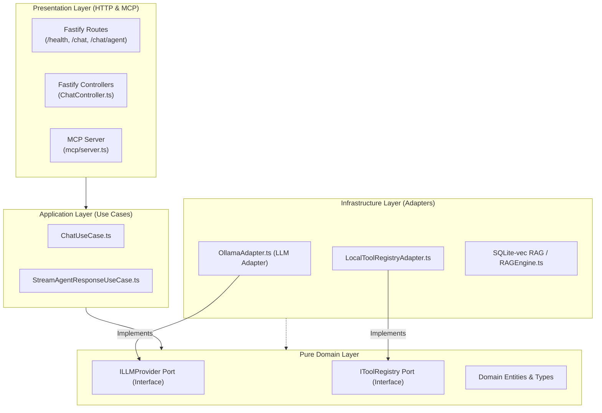

# NodeAI — SOTA Local LLM & MCP Integration Platform

[](https://www.typescriptlang.org/)
[](https://fastify.dev/)
[](https://ollama.com/)
[](https://opensource.org/licenses/MIT)

An elite, security-hardened, and clean-architecture-compliant integration platform. NodeAI couples **Fastify 5** and **SQLite-vec** powered RAG database with a modern, high-performance **Model Context Protocol (MCP) Server**, allowing orchestrators like Claude Desktop to consume local tools and semantic documentation seamlessly.

---

## BONUS
I used tools like SonarQube, prettier, and eslint-config-prettier to analyze the codebase and refactor it to meet the highest standards of code quality.

##  Clean Architecture (Hexagonal Model)

Following Uncle Bob's and Martin Fowler's Clean Architecture principles, the codebase is separated into highly decoupled, single-responsibility layers:



---

##  Tech Stack & Core Features

- **Runtime & Engine:** Node.js (>=24.0.0) powered by ESM and strictly typed `TypeScript 6`.
- **Web Framework:** Fastify v5 with schema-driven body validation and robust error handling.
- **Local LLM Integration:** High-performance local inference via `Ollama` (`llama3.2` / `nomic-embed-text` for vector embeddings).
- **Vector Database & RAG:** Real-time semantic document indexing using SQLite with `sqlite-vec` extension for in-memory cosine similarity search.
- **SOTA MCP Server:** Fully migrated to the modern `@modelcontextprotocol/sdk` (McpServer, ResourceTemplates) exposing stdio transport interfaces.

---

##  Developer Setup & Commands

### Prerequisites

- Node.js (>=24.0.0)
- Ollama installed and running locally with models:
  ```bash
  ollama pull llama3.2
  ollama pull nomic-embed-text
  ```

### Installation

```bash
npm install
```

### Script Directory

| Command          | Action                   | Description                                                  |
| ---------------- | ------------------------ | ------------------------------------------------------------ |
| `npm run dev`    | Start development server | Watch and reload using `tsx` on `http://localhost:3000`      |
| `npm run build`  | Compile TypeScript       | Emits production JavaScript files into the `dist/` directory |
| `npm run start`  | Start production build   | Run the compiled entry point `dist/server.js`                |
| `npm run lint`   | Run ESLint check         | Lints project and auto-fixes layout or typings issues        |
| `npm run format` | Run Prettier             | Auto-formats codebase to align with clean code style guide   |

---

##  Robust Testing & Quality Assurance

### End-to-End (E2E) Verification

NodeAI includes an in-process, port-isolated E2E validation script leveraging Fastify's native `.inject()` interface. This allows checking router mapping, schema validation, and pipeline stability securely:

```bash
npx tsx src/test-e2e.ts
```

### MCP server Verification

Test tools and resources in real-time using the official Anthropic MCP Inspector:

```bash
npx @modelcontextprotocol/inspector node --import tsx/esm src/mcp/server.ts
```

_Access the Inspector dashboard at `http://localhost:6274` to list tools, call endpoints, and verify resources._

---

##  Claude Desktop Configuration

To link this server as a high-performance tools broker inside Claude Desktop:

1.  Locate `claude_desktop_config.json`:
    - **macOS:** `~/Library/Application Support/Claude/claude_desktop_config.json`
    - **Linux:** `~/.config/claude-desktop/config.json`
2.  Register the `mongpt` MCP server:

```json
{
  "mdevServers": {
    "mongpt": {
      "command": "node",
      "args": [
        "--import",
        "tsx/esm",
        "/chemin/absolu/vers/nodeai2/src/mcp/server.ts"
      ],
      "env": {
        "OLLAMA_URL": "http://localhost:11434",
        "EMBED_MODEL": "nomic-embed-text"
      }
    }
  }
}
```

---

##  Authors & Clean Code Standards

# Rodrigue BASTE - IT Student

NodeAI is designed and maintained according to clean code standards:

- **SOLID Principles:** High abstraction, strictly defined interfaces, single-responsibility components.
- **Zero-Any Policy:** Highly precise type declarations, comprehensive TypeScript configurations.
